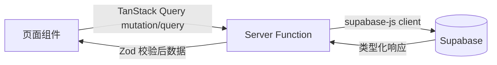

# 技术架构

## 开发工具

- Cursor Ultra
- **Vite+** — 统一前端工具链（`vp` CLI）
- **TanStack** 全栈生态 — 文档以 [llms.txt](https://tanstack.com/llms.txt) 为优先索引（内容较新）

---

## 前端工具链：Vite+

**必须使用 [Vite+](https://viteplus.dev/)** 作为 Monorepo 统一工具链，与 TanStack Start 配合使用。

Vite+ 将构建、检查、测试、脚本执行整合为单一 CLI，替代分散的 npm scripts 与多工具配置。

### 核心命令

| 命令 | 用途 |
|------|------|
| `vp install` | 依赖安装（自动识别包管理器） |
| `vp dev` | 开发服务器（TanStack Start SSR） |
| `vp build` | 生产构建 |
| `vp check` | 格式化 + Lint + 类型检查（Oxfmt、Oxlint、tsgo） |
| `vp test` | 单元 / 集成测试（Vitest） |
| `vp run` | Monorepo 任务编排（带缓存与依赖感知） |

### 项目配置

```json
{
  "devDependencies": {
    "vite": "npm:@voidzero-dev/vite-plus-core@latest",
    "vite-plus": "latest"
  },
  "overrides": {
    "vite": "npm:@voidzero-dev/vite-plus-core@latest"
  }
}
```

- 统一配置文件：
  - **根目录** [`vite.config.ts`](../../vite.config.ts) — Oxfmt / Oxlint / `vp check` / `vp run` 任务
  - **`apps/web/vite.config.ts`** — TanStack Start 插件、Nitro、CSS Modules、`vp dev` / `vp build`
- **`apps/web`** 与 **`apps/dashboard`** 均通过 Vite+ 驱动；根目录 `pnpm dev` = `vp dev apps/web`
- Monorepo 根目录使用 `vp run` 执行跨包任务；`pnpm.overrides` 在 `pnpm-workspace.yaml` 中将 `vite` 指向 `@voidzero-dev/vite-plus-core`

### 与 TanStack 的关系

```txt
Vite+（构建 / 检查 / 测试）
  ↓
TanStack Start（全栈框架 + Server Functions）
  ↓
TanStack Router / Query / Form / Table / Virtual / Store
```

**说明：** 禁止的是 **独立 Vite SPA**（无 SSR 的全客户端应用），**不是** Vite+ 工具链本身。TanStack Start 通过 Vite+ 构建与开发。

---

## Monorepo 结构

```txt
matchtable/

apps/
├── web
├── dashboard

packages/
├── ui
├── api
├── database
├── shared
├── config
```

- **`apps/web`** — 面向用户的 TanStack Start 应用
- **`apps/dashboard`** — 管理后台
- **`packages/ui`** — 共享 UI 组件（shadcn/ui、Table Card 等）
- **`packages/api`** — Server Functions、Supabase 客户端封装
- **`packages/database`** — 类型、迁移、RLS 策略
- **`packages/shared`** — 共享工具与 Zod schema
- **`packages/config`** — ESLint、TypeScript、PostCSS（CSS Modules）、Vite+ / `vite.config.ts` 共享配置

---

# 前端技术栈

## 核心框架

**必须使用：**

- **Vite+** — 统一工具链（`vp dev` / `vp build` / `vp check` / `vp run`）
- TanStack Start
- React 19
- TypeScript

**禁止使用：**

- Next.js
- Remix
- 独立 Vite SPA（无 SSR 的全客户端脚手架）
- CRA (Create React App)

## TanStack 生态

**必须使用：**

- TanStack Start
- TanStack Router
- TanStack Query
- TanStack Form
- TanStack Table
- TanStack Virtual
- TanStack Store

---

## 路由树

TanStack Router 基于文件的路由：

```txt
src/routes

__root.tsx

index.tsx

login.tsx

register.tsx

discover.tsx

profile/
 ├─ create.tsx
 ├─ edit.tsx
 └─ $id.tsx

me/
 ├─ index.tsx
 ├─ favorites.tsx
 └─ requests.tsx

compare.tsx
```

| 路由 | 用途 | 是否需要 SSR |
|------|------|--------------|
| `index.tsx` | 首页 | 是 |
| `login.tsx` | 登录 | 否 |
| `register.tsx` | 注册 | 否 |
| `discover.tsx` | 发现广场 | 是 |
| `profile/create.tsx` | 创建 MatchTable | 否 |
| `profile/edit.tsx` | 编辑 MatchTable | 否 |
| `profile/$id.tsx` | 用户详情 | 是 |
| `me/index.tsx` | 我的资料 | 否 |
| `me/favorites.tsx` | 收藏列表 | 否 |
| `me/requests.tsx` | 牵线请求 | 否 |
| `compare.tsx` | 资料对比（多表横向对照） | 否 |

---

## 数据获取

所有服务端数据**必须**通过 **TanStack Query** 获取。

**禁止使用：**

```ts
useEffect(() => {
  fetch(...)
})
```

**必须使用：**

- `queryOptions`
- `mutationOptions`

---

## 表单

**必须使用：** TanStack Form

**禁止使用：**

- React Hook Form
- Formik

---

## 校验

**必须使用：** Zod

用于：

- 表单校验
- API 校验
- Server Function 校验

---

## Server Functions 与数据流

**必须使用：** TanStack Start Server Functions

**禁止：** 不要创建独立的 Express API 服务。

### 数据流

```txt
Page
  ↓
Server Function
  ↓
Supabase
  ↓
Response
```



### 流程规则

1. 页面通过 TanStack Query（`queryOptions` / `mutationOptions`）调用 Server Functions。
2. Server Functions 通过 Supabase session 认证，执行数据库/存储操作，并用 Zod 校验。
3. 页面组件不得直接调用 Supabase 进行变更；读取可通过带 SSR loader 的 Server Functions 完成。
4. 所有表受 RLS 保护 — Server Functions 使用已认证的 Supabase 客户端。

---

## SSR

**必须使用：**

- SSR
- Streaming
- SEO Support

**必须使用 SSR 的页面：**

- 首页（`index.tsx`）
- 发现广场（`discover.tsx`）
- 用户详情页（`profile/$id.tsx`）

上述路由使用 Suspense 与 Streaming。

---

## 状态管理

**优先级顺序：**

1. TanStack Query
2. TanStack Store
3. React State

**禁止使用：**

- Redux
- MobX
- Zustand

---

## UI 组件

**必须使用：**

- CSS Modules（`.module.css`）
- shadcn/ui（组件逻辑与 API；样式适配为 CSS Modules）
- Radix UI

**禁止使用：**

- TailwindCSS（含 v3 / v4）

**要求：**

- Light mode default（默认浅色模式）；深色模式可选切换
- 响应式布局
- Accessibility（a11y）

设计 token 通过 CSS 自定义属性管理；主题切换使用 `[data-theme="dark"]` 或等效机制。详见 [11-ui-design.md](./11-ui-design.md)。

---

## 动效

**必须使用：** Motion

用于：

- 页面过渡
- Dialog
- Drawer
- 卡片动效

---

# 后端技术栈

**必须使用：**

- Supabase Auth
- Supabase Database
- Supabase Storage
- Supabase Realtime

---

## Supabase 要求

**须启用：**

- RLS (Row Level Security)
- Storage
- Realtime

所有表须配置：

- Row Level Security
- Policies

Schema 与模块访问矩阵见 [09-database.md](./09-database.md)。

---

## 官方文档（优先顺序）

TanStack 文档更新频繁，**开发时优先查阅 llms.txt 索引**，再按需跳转各包文档：

1. **[https://tanstack.com/llms.txt](https://tanstack.com/llms.txt)** — 全站文档聚合索引（**首选**）
2. [TanStack Start](https://tanstack.com/start)
3. [TanStack Router](https://tanstack.com/router)
4. [TanStack Query](https://tanstack.com/query)
5. [TanStack Form](https://tanstack.com/form)
6. [TanStack Table](https://tanstack.com/table)
7. [TanStack Virtual](https://tanstack.com/virtual)
8. [TanStack Store](https://tanstack.com/store)
9. [Vite+](https://viteplus.dev/) — 工具链 CLI 与配置

Cursor / Plan Mode 生成代码前，应先读取 `llms.txt` 获取最新 API 与模式，避免依赖过时的训练数据。
