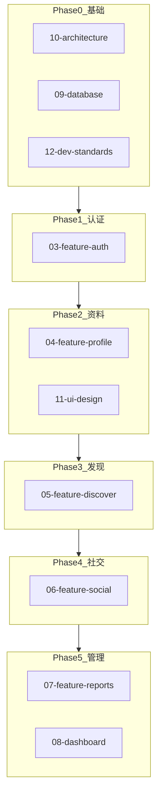

# MatchTable PRD — 文档索引

版本：**MVP v1.0**

本目录包含 MatchTable（相亲表）拆分后的产品需求文档。在 Cursor Plan Mode 中通过 `@` 引用，可按实现阶段仅加载相关模块。

---

## 文档地图

| # | 文档 | 摘要 |
|---|------|------|
| 01 | [产品概览](./01-product-overview.md) | 产品定位、目标、MVP 纳入/排除范围 |
| 02 | [角色与流程](./02-roles-and-flows.md) | 访客、注册用户、管理员权限；注册与牵线流程 |
| 03 | [认证](./03-feature-auth.md) | Google、Apple、Github、手机 OTP，基于 Supabase Auth |
| 04 | [资料（MatchTable）](./04-feature-profile.md) | 资料字段、爱好、自我介绍、择偶要求、联系方式、照片（1–9） |
| 05 | [发现广场与详情](./05-feature-discover.md) | 广场列表、筛选、排序、用户详情、**资料对比**（多表横向对照，可固定自己的相亲表） |
| 06 | [收藏与牵线请求](./06-feature-social.md) | 收藏 CRUD；牵线请求、状态机、联系方式解锁 |
| 07 | [举报](./07-feature-reports.md) | 举报类型与文字说明 |
| 08 | [Dashboard 管理后台](./08-dashboard.md) | 统计、用户/资料/举报管理 |
| 09 | [数据库 Schema](./09-database.md) | profiles、profile_photos、favorites、requests、reports 完整 SQL |
| 10 | [技术架构](./10-architecture.md) | Monorepo、**Vite+** 工具链、TanStack 全栈、路由树、Server Function 数据流、SSR、RLS |
| 11 | [UI 设计](./11-ui-design.md) | Editorial Luxury 方向、CSS Modules、浅色默认、Table Card 品牌 |
| 12 | [开发规范与验收](./12-dev-standards.md) | Cursor 代码生成规则、官方参考、MVP 验收清单 |

---

## MVP 范围速查

### 纳入

- 用户注册与登录
- MatchTable 创建 / 编辑
- 照片上传
- 发现广场浏览
- 搜索与筛选
- 资料对比（可固定自己的相亲表）
- 收藏
- 牵线请求
- 联系方式交换（双方接受后）
- Dashboard 管理后台

### 排除

- AI 功能
- 聊天系统
- 会员系统
- 支付系统
- 实名认证
- 推荐算法
- 小程序
- 原生 APP

完整说明见 [01-product-overview.md](./01-product-overview.md)

---

## Plan Mode 使用示例

每次规划会话引用 1–3 份文档，避免上下文过载。

**Phase 0 — 基础（Monorepo + Supabase + Vite+）：**

```
@docs/prd/10-architecture.md @docs/prd/09-database.md @docs/prd/12-dev-standards.md
Scaffold monorepo with Vite+ (vp) and TanStack Start; read https://tanstack.com/llms.txt first
```

**Phase 2 — 资料 CRUD + 照片：**

```
@docs/prd/04-feature-profile.md @docs/prd/09-database.md @docs/prd/11-ui-design.md
Implement MatchTable create and edit with photo upload
```

**Phase 3 — 发现广场 + 资料对比：**

```
@docs/prd/05-feature-discover.md @docs/prd/11-ui-design.md
Implement discover plaza, profile detail, and Compare Table with sticky own-profile column
```

**Phase 4 — 社交（收藏 + 牵线请求）：**

```
@docs/prd/06-feature-social.md @docs/prd/09-database.md
Implement favorites and connection request flow with contact unlock
```

**Phase 6 — MVP 验收：**

```
@docs/prd/12-dev-standards.md
Run through MVP acceptance checklist and fix gaps
```

---

## 实现阶段映射



| 阶段 | 任务 | 必读文档 | 可选文档 |
|------|------|----------|----------|
| 0 | Monorepo 脚手架 + Supabase + Vite+ 初始化 | `10-architecture`、`09-database`、`12-dev-standards` | `01-product-overview` |
| 1 | 认证（OAuth + 手机 OTP） | `03-feature-auth`、`10-architecture` | `02-roles-and-flows` |
| 2 | MatchTable CRUD + 照片上传 | `04-feature-profile`、`09-database`、`11-ui-design` | `02-roles-and-flows` |
| 3 | 发现广场 + 用户详情 | `05-feature-discover`、`11-ui-design` | `04-feature-profile` |
| 4 | 收藏 + 牵线请求 + 联系方式 | `06-feature-social`、`09-database` | `02-roles-and-flows` |
| 5 | 举报 + Dashboard 管理 | `07-feature-reports`、`08-dashboard` | `02-roles-and-flows` |
| 6 | MVP 验收 | `12-dev-standards` | 全部 |

**模块依赖顺序：** Auth → Profile → Discover → Social → Admin

---

## 按角色查阅文档

| 角色 | 从这里开始 | 另可参考 |
|------|------------|----------|
| **产品** | [01-product-overview](./01-product-overview.md)、[02-roles-and-flows](./02-roles-and-flows.md) | 功能文档 03–08 了解模块细节 |
| **前端** | [10-architecture](./10-architecture.md)、[11-ui-design](./11-ui-design.md)、[12-dev-standards](./12-dev-standards.md) | 当前阶段对应的功能文档 |
| **后端 / 数据** | [09-database](./09-database.md)、[10-architecture](./10-architecture.md) | 功能文档用于 RLS 策略设计 |
| **设计** | [11-ui-design](./11-ui-design.md)、[04-feature-profile](./04-feature-profile.md) | [05-feature-discover](./05-feature-discover.md) 了解列表/详情布局 |

---

## Cursor Rules

项目级约束亦已提取至：

- [`.cursor/rules/matchtable-stack.mdc`](../../.cursor/rules/matchtable-stack.mdc) — TanStack + Supabase 技术栈（始终应用）
- [`.cursor/rules/matchtable-ui.mdc`](../../.cursor/rules/matchtable-ui.mdc) — UI 设计约束（`**/*.{tsx,css}`）
